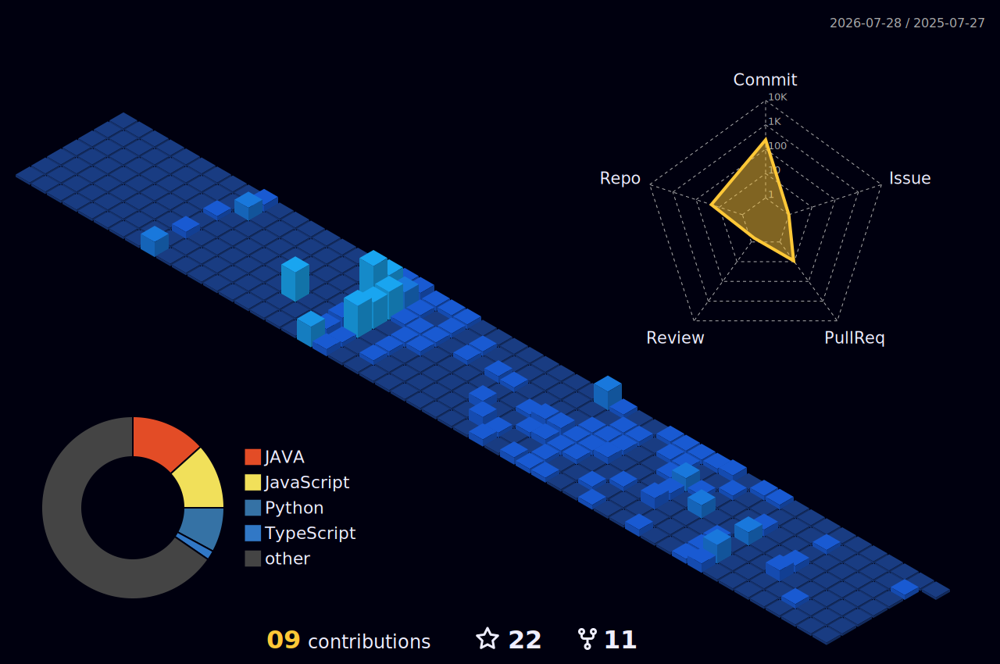

 
<!-- Typing SVG by DenverCoder1 - https://github.com/DenverCoder1/readme-typing-svg -->

 
 
  <!--Crédit https://www.deviantart.com/dokitsu/art/Kuro-s-the-black-wizard-Mazgeon-605238839-->
  

 

<h1 align="center">Hi There! &nbsp;&nbsp;&nbsp;I'm </h1>

<h3 align="center">

</h3>

<h3 align="center"><strong> A Passionate Full Stack Engineer from India  </strong> </h3>

  

  

- 🔭 I’m currently working on **lightxeditor.com**

- 🌱 I’m currently learning **GenAi,Ai,ml,LAngchain,langGraph,rssfeed,**

- 💬 Ask me about **java,python,javascript,angular,Aws,Elasticsearch,Apache Solr,Kafka,System Design**

- 📫 reach me @  **paritoshupreti1999@gmail.com**

 

   
## What I’m Building

 Low‑latency, fault‑tolerant backend services for LightX Editor: Spring Boot microservices, circuit breakers, idempotency, and horizontal scalability with efficient caching and async queues.

AI/ML integrations in production: embedding pipelines, RAG services, vector search, and model orchestration (LangChain/LangGraph) with observability, rollback, and A/B evaluation.

Data and search platforms: Elasticsearch/Solr relevance tuning, synonyms/analyzers, analytics-driven ranking, and near‑real‑time indexing.

Secure API platforms: versioned REST APIs, OAuth2/JWT, rate limiting, request tracing, and SLO-driven performance budgets.

Developer velocity: CI/CD pipelines, schema/version governance, automated quality gates, and golden paths for AI feature rollout.
 

<h2 align='center'><strong>Socials Profiles 💻</strong></h2>

   

  
</a>

  

<h2 align='center'><strong>Languages, Tools and Technologies 🚀 </strong></h2>
	 
<table>
	<tr>
		<td><strong>Programming Languages</strong></td>
		<td></td>
	</tr>
	<tr>
		<td><strong>Frontend Development</strong></td>
		<td></td>
	</tr>
	<tr>
		<td><strong>Backend Development</strong></td>
		<td></td>
	</tr>
	<tr>
	<tr>
		<td><strong>Database Technologies</strong></td>
		<td></td>
	</tr>
	<tr>
		<td><strong>Frameworks</strong></td>
		<td></td>
	</tr>
	<tr>
		<td><strong>Cloud Deployment</strong></td>
		<td></td>
	</tr>
	<tr>
		<td><strong>Hosting Services</strong></td>
		<td></td>
	</tr>
	<tr>
		<td><strong>Developer Tools</strong></td>
		<td> 
	</td>
	</tr>
	<tr>
		<td><strong>Debugging Tools</strong></td>
		<td>  &nbsp; &nbsp; &nbsp; &nbsp;&nbsp;</td>
	</tr>
	<tr>
		<td><strong>Collaboration Platforms</strong></td>
		<td>  </td>
	</tr>
	<tr>
		<td><strong>Operating System</strong></td>
		<td>
		  </a>  <a href="https://www.cprogramming.com/" target="_blank" rel="noreferrer">
		</td>
	</tr>
</table>

  

## Signal > Noise

Backend first: correctness, latency, resilience.

AI with rigor: measurable lift, eval harnesses, safety/guardrails.

Search that performs: relevant, explainable, fast.

Operability: tracing, metrics, alerts—before scale hits.

Ship value: iterate with data, retire what doesn’t move metrics.

Ship value.

  <h2>🐍✨ Watch the Snake Devour My Contributions! ✨🐍</h2>
   
  
   
  
<i>Every commit I make, the snake grows stronger... 🧠🔥</i>

    

<h2 align="center">⚡️ Stats ⚡️</h2>
 

 <tr>
		  <th colspan="2" align="center">
			   
		  </th>
		</tr>

 <th style="padding: 20px; text-align: center;">
          
        </th>

 <th style="padding: 20px; text-align: center;">
          
        </th>

   

  

 

 

</table>

 
 

